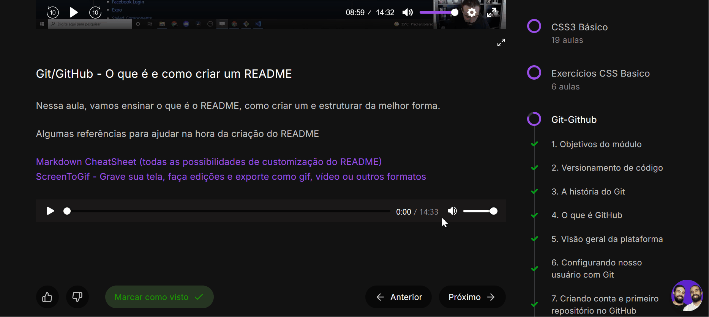

# Projeto com README

um projeto de teste com um arquivo README 🚀

[]

## Tecnonoligias utilizadas
- HTML
- CSS
- JS

## Como Utilizar
 
1 - Clone pro Projeto
```
git clone <url>
```

2 - Acess a pasta do projeto
```
cd repositorio-com-readme
```